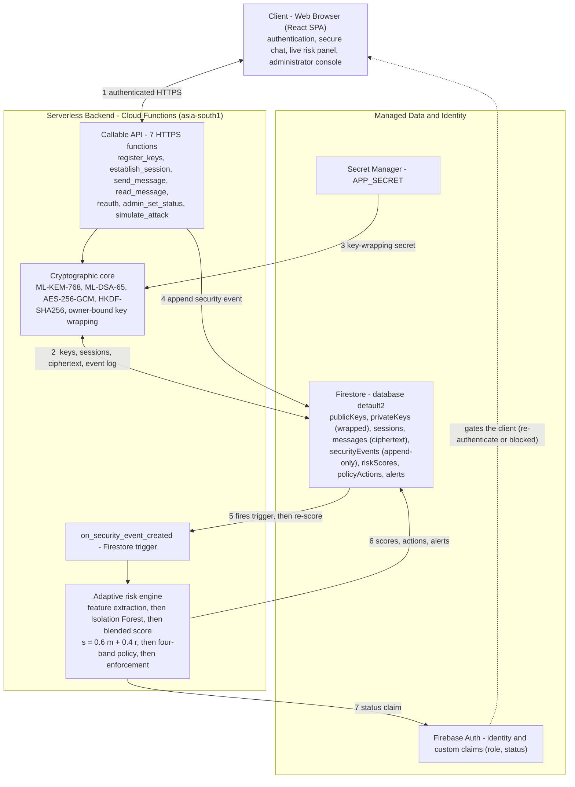
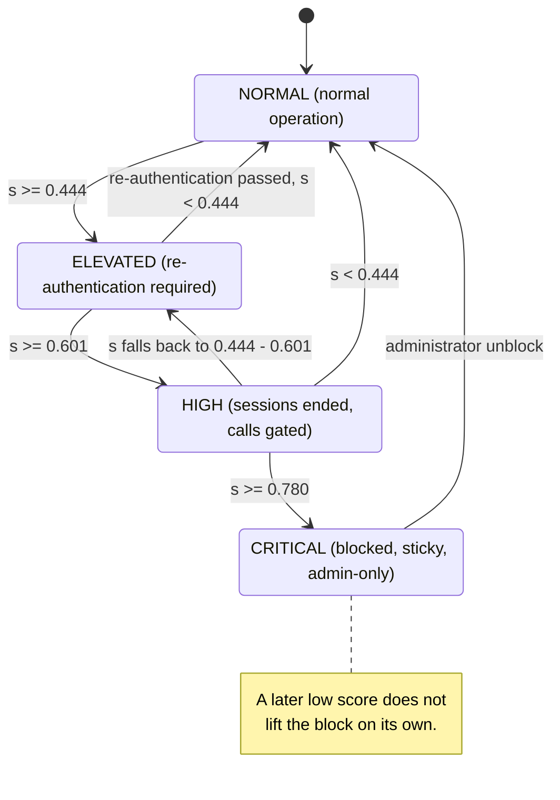

<div align="center">

# 🔐 Cipher &amp; Seal

### Smart Quantum-Safe Communication System

**Post-quantum encrypted messaging with an AI risk engine that watches every account and contains threats on its own.**

Session keys with **ML-KEM-768** · signatures with **ML-DSA-65** · payloads with **AES-256-GCM** ·
an **Isolation Forest** scoring behaviour into a four-band policy that escalates from re-authentication to a hard lock.

[](https://legaldoc-14f4d.web.app)


[**Live demo**](https://legaldoc-14f4d.web.app) &nbsp;·&nbsp; [Architecture](#architecture) &nbsp;·&nbsp; [Cryptography](#cryptographic-design) &nbsp;·&nbsp; [Risk engine](#adaptive-risk-engine) &nbsp;·&nbsp; [Run it](#running-it)

</div>

---

## The problem

Almost every public-key system in use today rests on factoring or the discrete logarithm, and **Shor's algorithm breaks both on a quantum computer**. That machine does not exist yet, but an attacker can record encrypted traffic now and decrypt it once it does — *harvest now, decrypt later*. Anything that must stay secret for a decade is already exposed.

A quantum-safe channel still does not help when an attacker signs in with a **stolen password**, and it does not notice a client that has started to flood the server or probe other users. Most systems treat strong cryptography and behavioural monitoring as separate problems.

**Cipher &amp; Seal puts them on the same message path.** Standardised post-quantum key establishment and signatures protect every message; an unsupervised anomaly model rates every account; and the model is wired straight into an enforcement state machine, so a compromised account is re-challenged, cut off, or locked within the time it takes to score one event — no analyst in the loop.

---

## What it does

| | |
|---|---|
| 🔑 **Post-quantum identity** | Each user gets an ML-KEM-768 keypair and an ML-DSA-65 keypair at registration. Private keys are wrapped under an authenticated cipher bound to their owner. |
| ✉️ **Signed, sealed messages** | Every message is AES-256-GCM encrypted under a signed session key; the recipient verifies the ML-DSA signature **before** decrypting — a broken seal is refused, never parsed. |
| 🧠 **Behavioural risk score** | An Isolation Forest reads an 11-feature, 300-second window of security events and produces a score, blended with deterministic rule signals. |
| 🚦 **Automatic response** | Four bands — `NORMAL → ELEVATED → HIGH → CRITICAL` — escalate from forced re-authentication to session termination to a sticky administrative lock. |
| 🛰️ **Serverless & live** | Eight Cloud Functions, a Firestore database, participant-scoped security rules, and a React client, deployed and running. |
| 🧪 **Attack simulator** | An admin console drill writes a synthetic brute-force / message-flood / off-hours burst and you watch the account escalate in real time. |

---

## Architecture



The client never touches the database directly — every read and write goes through a callable function or a participant-scoped security rule. When a function appends a security event, a Firestore trigger re-scores the account and applies the matching policy in the same step.

---

## Cryptographic design

| Primitive | Standard | Role |
|---|---|---|
| **ML-KEM-768** | FIPS 203 | Key encapsulation — establishes the session secret |
| **ML-DSA-65** | FIPS 204 | Signatures — session transcript and every message |
| **AES-256-GCM** | FIPS 197 / SP 800-38D | Authenticated encryption of payloads and wrapped keys |
| **HKDF-SHA256** | RFC 5869 | Session-key and wrapping-key derivation |

- **Owner-bound key wrapping.** Private keys are sealed with AES-256-GCM under `HKDF(APP_SECRET, salt, "wrap" ‖ alg ‖ uid)`, and the algorithm label and owner id are also bound as GCM associated data. A wrapped blob copied to another account, or relabelled, fails its authentication check instead of yielding a usable key.
- **Signed session establishment.** The initiator runs `ML-KEM.Encaps` against the peer's public key, derives the session key from the shared secret, and signs `ciphertext ‖ initiator_uid ‖ peer_uid`. The peer verifies before accepting — the exchange cannot be replayed between different pairs.
- **Verify before decrypt.** On the read path the ML-DSA signature is checked first; only a valid signature triggers decryption.

> [!WARNING]
> The post-quantum primitives use the pure-Python reference libraries `kyber-py` and `dilithium-py`. They follow the standards closely and are easy to read, but **they are not constant-time** and must not be used unmodified in production. Cryptographic operations currently run server-side inside the callable functions, so this is not end-to-end encryption — moving `Encaps` and AEAD into client WebAssembly is the main open item.

---

## Adaptive risk engine

### Features — one 300-second window

| # | Feature | Signal |
|---|---|---|
| 1–2 | `login_fail_count`, `login_fail_rate` | credential guessing |
| 3–4 | `msg_sent_count`, `msg_rate_per_min` | flooding / bulk send |
| 5 | `mean_msg_interval_s` | scripted vs. human cadence |
| 6 | `msg_size_mean` | bulk transfer |
| 7 | `distinct_recipients` | spray across users |
| 8 | `session_count` | session churn |
| 9–10 | `hour_of_day_sin`, `hour_of_day_cos` | off-hours activity |
| 11 | `sim_attack_flag` | drill marker |

### Score

```
model score  m  =  minmax( -IsolationForest.decision_function , p5 , p99 )   # 200 trees, contamination 0.05
rule boost   r  =  clamp( Σ  { brute_force ≥5 fails: +0.40,  msg_flood >30/min: +0.30,
                              off_hours burst: +0.20,  sim_attack marker: +0.30 } , 0, 1 )
blended      s  =  clamp( 0.6·m + 0.4·r , 0, 1 )
```

The upper normalisation anchor is the **99th** percentile, not the 95th: a p95 anchor pushes 5 % of ordinary traffic to a maximal score, enough to reach `HIGH` on its own. Moving it to p99 cut baseline false-`HIGH` from ≈9 % to <1 %.

### Bands and enforcement



| Band | Score `s` | Automatic response |
|---|---|---|
| `NORMAL` | `< 0.444` | none |
| `ELEVATED` | `0.444 – 0.601` | re-authentication required |
| `HIGH` | `0.601 – 0.780` | active sessions ended; further calls gated server-side |
| `CRITICAL` | `≥ 0.780` | account blocked; admin-only, sticky unblock |

---

## Tech stack

| Layer | Choice |
|---|---|
| **Crypto + AI core** | Python 3.12, `kyber-py`, `dilithium-py`, `cryptography`, `scikit-learn`, `numpy` — no cloud dependencies |
| **Backend** | Cloud Functions for Firebase (Python 3.12, gen 2), region `asia-south1` — 7 HTTPS callables + 1 Firestore trigger |
| **Data** | Cloud Firestore (non-default database `default2`), participant-scoped security rules, composite indexes |
| **Secrets & identity** | Secret Manager (`APP_SECRET`), Firebase Auth with custom claims (`role`, `status`) |
| **Frontend** | React 19, Vite, TypeScript, Tailwind, `recharts` — the *"Cipher &amp; Seal"* paper-and-wax visual design |
| **Hosting** | Firebase Hosting → [legaldoc-14f4d.web.app](https://legaldoc-14f4d.web.app) |
| **Tests** | 128 automated tests, run against a real Firestore under a per-run collection prefix that is wiped around each test |

---

## Project layout

```
functions/
  quantumsafe/
    crypto/      kdf · aead · kem · sign · keystore        (ML-KEM, ML-DSA, AES-GCM, owner-bound wrapping)
    ai/          features · model · risk · synthetic       (Isolation Forest, blended score, synthetic data)
    security/    events · policy                           (event vocabulary, 4-band state machine)
    fb/          config · client · errors · repo · events · identity · sessions ·
                 messaging · scoring · enforcement · simulation · gating
    pipeline.py                                            (end-to-end reference flow)
  main.py        8 Cloud Functions (7 callables + on_security_event_created trigger)
  scripts/       seed_baseline.py (trains model.joblib + thresholds.json) · smoke_live.py
  tests/         128 tests
web/
  src/
    pages/       Home · Login · Register · Chat · Admin
    components/   RiskInstrument · MessageThread · StartSession · AttackSim · UserTable · …
    lib/         api · firebase · realtime hooks
firestore.rules · firestore.indexes.json · firebase.json
```

---

## Running it

### Tests (crypto + AI + backend)

```bash
cd "quantom coimmunication"
python -m pip install -r functions/requirements.txt
python -m pytest -q          # 128 tests
```

Backend tests hit a **real** Firestore under a throwaway `test_<uuid>_` prefix (auto-wiped), so they exercise real query semantics and server timestamps. They need Firebase credentials and `APP_SECRET` in the environment.

### Frontend

```bash
cd web
npm install
npm run dev                  # local dev server
npm run build                # production build → web/dist
```

The client reads `getFirestore(app, "default2")` and calls `getFunctions(app, "asia-south1")`.

### Deploy

```bash
firebase deploy --only functions --project legaldoc-14f4d
firebase deploy --only firestore:rules,firestore:indexes --project legaldoc-14f4d
cd web && npm run build && cd .. && firebase deploy --only hosting --project legaldoc-14f4d
```

The Python deploy needs a local `functions/venv/` for Firebase's function discovery; functions run at 512 MiB (1 GiB for the trigger) because the scikit-learn import overflows the 256 MiB default.

---

## Status

- ✅ Post-quantum crypto core + Isolation-Forest risk engine + 4-band policy — **128 tests passing**
- ✅ Eight Cloud Functions deployed to `asia-south1`, Firestore rules + indexes live on `default2`
- ✅ React client deployed to Firebase Hosting
- ✅ End-to-end verified: register → key generation → signed session → sealed message → verified read
- ✅ Simulated brute-force drives an account to `HIGH` automatically; `CRITICAL` block confirmed sticky

---

## Limitations

> [!NOTE]
> This is a **final-year undergraduate research project**, shared for educational purposes.

- Reference PQC libraries are not constant-time.
- Server-mediated cryptography — plaintext exists briefly inside the functions. Not end-to-end.
- `HIGH` is a re-authentication gate, not ID-token revocation; a client that ignores its `status` claim keeps a valid token until it expires.
- The auto-block threshold is tuned on synthetic data and should carry a human-in-the-loop confirmation step before any real deployment.
- `APP_SECRET` must be rotated before real use.

---

<div align="center">
<sub>Built with post-quantum cryptography and a small anomaly model that answers when something looks wrong.</sub>
</div>
